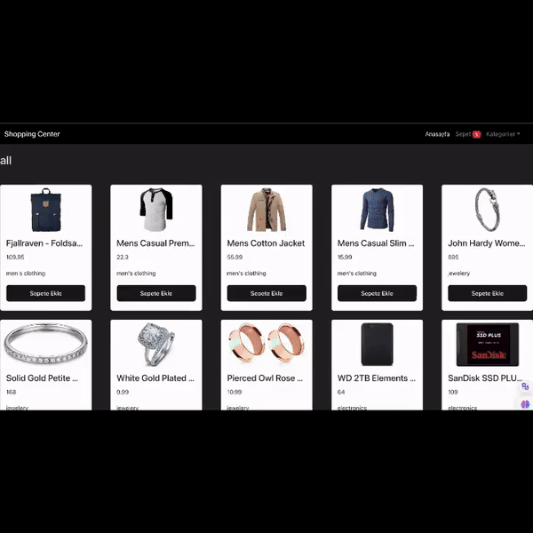

<h1>Shopping Center E-Commerce Website</h1>

This project is an e-commerce website created using modern web development technologies. React, React Router DOM, Context API, HOC (Higher Order Components), Bootstrap, Axios, and Toastify are some of the React features utilized in this project.

## Features

- Homepage: Designed to welcome users to the site and display popular products.
- Categories: Allows filtering by different product categories.
- Cart: Users can add, remove, increase, or decrease the quantity of items in their cart.
- Total Price: Displays the total price of items in the cart in real-time.

## Technologies Used

- React: Used for creating the user interface.
- React Router DOM: Used for managing page navigation and routing.
- Context API: Utilized for managing state across the application.
- HOC (Higher Order Components): Used for wrapping components to add and share different features.
- Bootstrap: Employed for quickly designing a responsive user interface.
- Axios: Used for making HTTP requests.
- Toastify: Utilized for displaying informative messages to the user.

<h3>Screenshot</h3>

